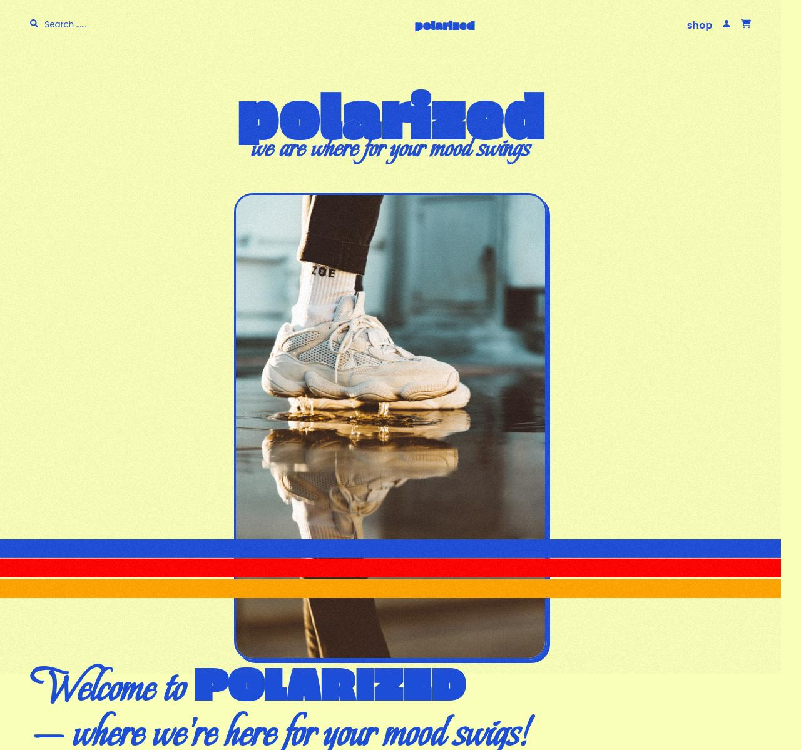

# Polarized E-Commerce Platform

Welcome to Polarized, where fashion meets mood! Polarized is an innovative e-commerce platform that offers a diverse range of unique clothing, accessories, and home goods. Our curated collection is designed to match your mood swings, whether you're feeling funny, brutal, classic, or discreet.

## Overview

Initiated and led the development of Polarized, a comprehensive e-commerce platform from the ground up. The platform encompasses web design, copy creation, branding, and a full-stack admin dashboard.

## Project Duration

[Start Date] - Present

## Role and Responsibilities

- Conceptualized and executed the entire project life cycle, including web design, brand development, and copy creation.
- Developed and implemented a fully functional e-commerce platform using the MERN stack (MongoDB, Express.js, React.js, Node.js).
- Designed and crafted a responsive, user-friendly interface with Styled Components.
- Currently focused on:
  - Performance optimization
  - Incorporating on-scroll animations
  - Adding additional features to the website and admin dashboard, including enhancing the Cart and Checkout pages.
- Collaborated with cross-functional teams to ensure seamless integration of design elements and functionality.
- Conducted rigorous testing and debugging for optimal performance and security.

## Achievements

- Successfully launched Polarized, achieving [Specify any notable achievements or milestones].
- Established a strong brand identity, contributing to increased user engagement and recognition.
- Streamlined administrative processes through the implementation of a comprehensive admin dashboard.

## Upcoming Enhancements

- Optimization of website performance through [Specify optimization strategies, e.g., code splitting, lazy loading].
- Implementation of on-scroll animations to enhance user engagement and visual appeal.
- Addition of user-friendly features to the admin dashboard for improved management and monitoring.
- Enhancements to the Cart and Checkout pages UI for a smoother user experience.

## Technologies Used

- MongoDB
- Express.js
- React.js
- Node.js
- Styled Components
- [Any other relevant technologies/tools]

## Screenshot

[Link to Live Demo](https://polarized-store.onrender.com)
